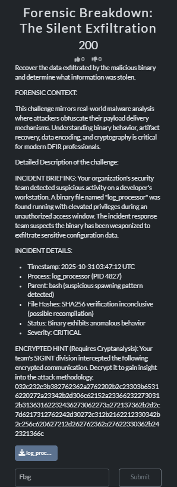
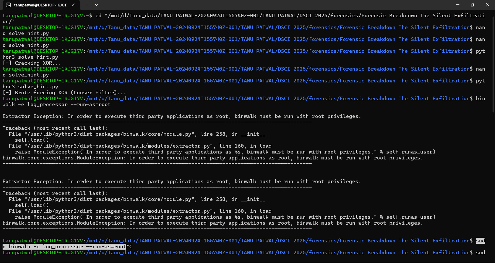

# Forensic Breakdown: The Silent Exfiltration

**Event:** EY-DSCI CTF 2025 (Pullman Aerocity, Delhi)  
**Category:** Forensics  
**Points:** 200  
**Date:** Dec 3, 2025

## Challenge Description 🕵️‍♀️

A security incident detected a suspicious binary, **`log_processor`**, running with elevated privileges on a developer's workstation. The objective was to determine what data was exfiltrated.

**Challenge Brief:**

**Artifacts Provided:**

- `log_processor`: A 64-bit ELF binary.
- **Encrypted Hint:** A hex string provided in the challenge details.

---

## Solution Walkthrough

### 1. Cryptanalysis (Decoding the Hint)

The encrypted hex string was analyzed using a **Single Byte XOR cipher** brute-force attack.

**Methodology:**
I used the script [files/solve_hint.py](files/solve_hint.py), which employs a **"loose filter"**. This filter accepts results where >90% of the characters are readable ASCII. This heuristic was necessary because a strict filter failed due to potential noise bytes or formatting characters in the decrypted string.

**Execution:**

_Figure: assets/script_execution.png showing the successful key cracking output._

### 2. Binary Forensics with Binwalk

I analyzed the `log_processor` binary to search for embedded files using `binwalk`.

**Command:**

sudo binwalk -e log_processor --run-as=root

Note: The --run-as=root flag was used to execute binwalk without permission issues.

Result: binwalk detected a PNG image signature embedded within the binary at decimal offset 14520 (Hex 0x38B8).

Technical Note on Artifacts: The binwalk extraction process also generated redundant Zlib fragments like 38E1 or 38E1.zlib. These are the internal compressed data chunks of the PNG and were ignored.

### 3. Artifact Recovery (dd)
Using the exact offset found by binwalk, I used the dd command to manually carve the complete PNG file from the binary.

Command:
dd if=log_processor of=stego.png bs=1 skip=14520

Recovered File: assets/stego.png

### 4. Steganography Analysis (zsteg)
The extracted image, stego.png, appeared blank, confirming the use of LSB (Least Significant Bit) steganography. I used the zsteg tool to analyze the image's hidden data channels.

Command:
zsteg -a stego.png

Result: zsteg successfully identified the flag embedded in the b1,rgb,lsb,xy channel.

*Figure: assets/stego_extraction.jpg showing the dd extraction and the final zsteg output.*

Flag 🚩
CTFEYDSCI{DF!R_i5_c001}
